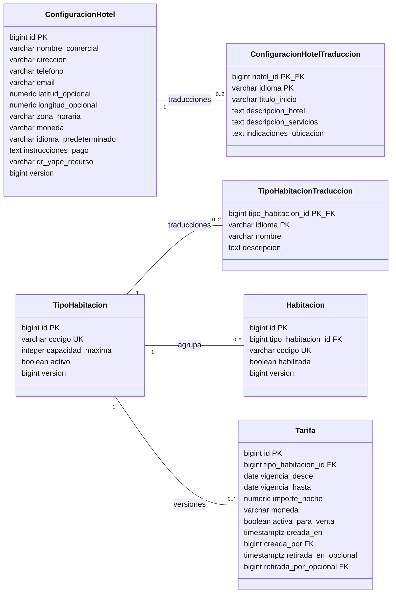
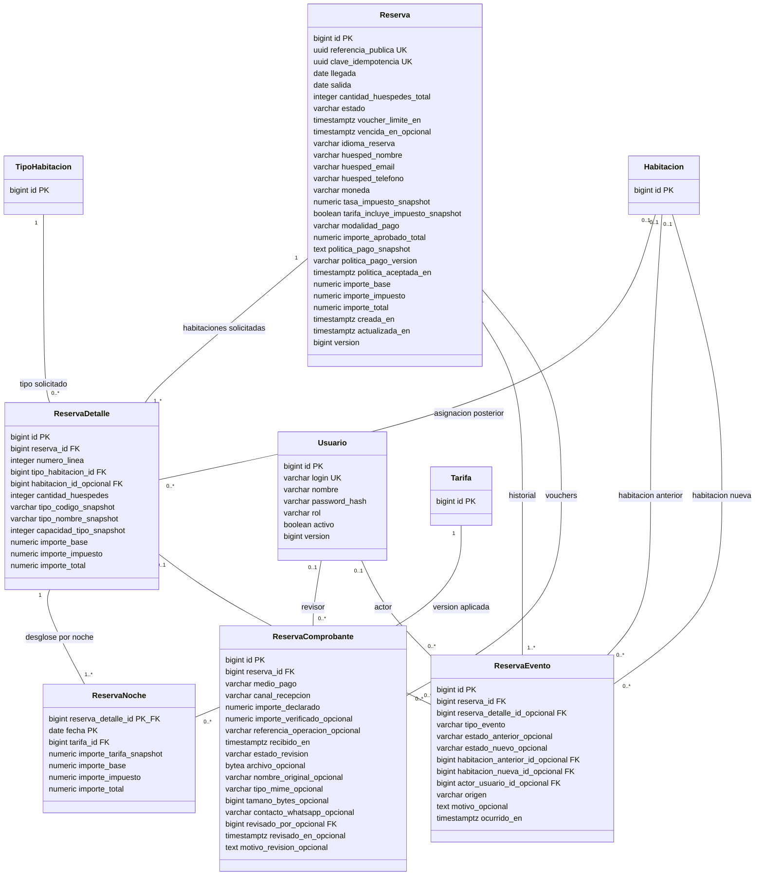

# Telo — Alcance V1

## Objetivo

Permitir que un visitante conozca el hotel y solicite una reservación de habitación. El personal autorizado gestiona las solicitudes, las habitaciones, sus tipos y las tarifas.

## Web pública

Secciones: Inicio, Habitaciones, Servicios, Galería, Ubicación y Contacto. La experiencia pública y el proceso de reservación estarán disponibles en español e inglés.

## Reservaciones

1. El visitante ingresa llegada, salida y cantidad de huéspedes.
2. El sistema consulta disponibilidad para el intervalo solicitado.
3. El visitante selecciona uno o varios tipos disponibles y la cantidad de habitaciones de cada tipo, incluyendo reservas en bloque.
4. El visitante registra sus datos y envía la solicitud.
5. El sistema registra la reserva con estado `PENDIENTE` y muestra una referencia de la solicitud.
6. Muestra el QR de Yape o las cuentas de depósito y el plazo para enviar el voucher.
7. El visitante sube el voucher en la web o lo envía al WhatsApp del personal por el pago total o un adelanto; el personal registra y verifica el pago, y puede confirmar la reserva por cualquier monto que apruebe.

Política comercial indicada por el usuario: los pagos no son reembolsables. Mostrar esta condición en español e inglés antes de solicitar el pago y registrar su aceptación. Cancelar libera habitaciones, pero no genera devolución. No existe adelanto mínimo: el personal puede aprobar cualquier monto y, al hacerlo, confirmar la reserva.

Plazo confirmado para enviar el voucher: dos horas si la llegada es el mismo día de creación de la reserva, cuatro horas si la llegada es otro día. Se propone contar desde el registro de la reserva pendiente y comparar fechas en `America/Lima`.

Enviar la solicitud no equivale a confirmar la reserva. La interfaz debe comunicar esta diferencia en ambos idiomas.

## Administración

Acceso mediante inicio de sesión para personal autorizado. Permite consultar reservas, confirmarlas o cancelarlas, y administrar habitaciones, tipos de habitación y tarifas.

Estados contemplados: `PENDIENTE`, `CONFIRMADA`, `CANCELADA` y `VENCIDA`. Enviar un voucher no confirma por sí solo: el personal debe verificar el pago.

## Criterios de aceptación

- Todas las secciones públicas son accesibles en español e inglés.
- Llegada, salida y cantidad de huéspedes son obligatorias; salida debe ser posterior a llegada y huéspedes debe ser un entero positivo.
- La disponibilidad contempla las fechas, capacidad y habitaciones habilitadas.
- Se verifica nuevamente la disponibilidad al registrar la reserva para evitar aceptar una selección que dejó de estar disponible.
- Toda solicitud nueva se registra como `PENDIENTE` y conserva las fechas, huéspedes, habitaciones solicitadas por tipo y datos del visitante.
- La reserva puede contener varias habitaciones; al registrarse como `PENDIENTE` compromete el bloque completo de forma atómica. Confirmarla conserva ese cupo y cancelarla lo libera.
- Si vence el plazo sin voucher recibido, la reserva pasa a `VENCIDA` y libera todas sus habitaciones. Se propone conservar el cupo de un voucher recibido a tiempo mientras el personal lo revisa.
- Moneda confirmada: soles (`PEN`). Las tarifas ingresadas ya incluyen el impuesto del 18%; no se suma nuevamente.
- Las operaciones administrativas requieren autenticación y autorización en el servidor.
- La confirmación vuelve a comprobar que existe disponibilidad; solicitudes concurrentes no pueden confirmar el mismo alojamiento para fechas superpuestas.
- Las modificaciones del catálogo y las tarifas no alteran el importe ni la información histórica de reservas ya registradas.

## Base técnica existente

El proyecto Spring Boot funciona con Java 21, Maven, Spring MVC, Thymeleaf, Spring Security, JPA, validación y PostgreSQL alojado en Supabase. La conexión de desarrollo está verificada. Aún no contiene las funcionalidades hoteleras descritas en este documento.

El arranque inicial muestra `Hola mundo`. Consultar el [onboarding](index.md) para ejecutarlo y el [manual de Supabase](supabase.md) para crear y conectar la base de datos.

## Fuera de alcance

Contabilidad, inventarios, facturación electrónica, caja, housekeeping, aplicación móvil, API pública y pasarela de pagos.

Mostrar medios de pago externos, recibir vouchers y verificarlos manualmente sí forma parte de V1. Esto no implica integración automática con Yape o bancos ni un módulo contable.

## Diseño técnico del dominio

Esta sección documenta la propuesta de diseño V1. No implica implementar entidades JPA, controllers, services, repositories, vistas ni migraciones. Las decisiones indicadas como pendientes deben resolverse antes de cerrar el modelo definitivo.

### Condiciones técnicas

- Mantener la arquitectura existente y la conexión JDBC/JPA estándar con PostgreSQL.
- Esquema de aplicación: `telo`.
- No utilizar Supabase SDK, API REST, Auth, Storage ni Edge Functions.
- Ejecutar los cambios de esquema mediante Flyway y mantener Hibernate con `ddl-auto=validate`.
- Usar tipos y funcionalidades de PostgreSQL independientes del proveedor para permitir una migración posterior.
- Dinero con `BigDecimal`; llegada y salida con `LocalDate`.
- El visitante selecciona un tipo de habitación. La habitación física se asigna posteriormente.
- Una reserva admite varias habitaciones, del mismo tipo o de distintos tipos. La asignación física es independiente para cada unidad solicitada.
- Tarifas variables, moneda `PEN` e impuesto del 18% incluido en el precio ingresado. Se propone variación por tipo y fecha; no se asumen descuentos por bloque.
- Mantener la información histórica de las reservas aunque cambien el catálogo o las tarifas.
- Textos estáticos con Spring i18n y contenido dinámico con tablas de traducción.
- No agregar módulos fuera del alcance ni una arquitectura de múltiples hoteles.

### A. Entidades y relaciones

| Concepto funcional | Propuesta V1 | Justificación |
| --- | --- | --- |
| Tipo de habitación | Tabla propia | Oferta, capacidad y agrupación de disponibilidad. |
| Habitación | Tabla propia | Inventario físico habilitado. |
| Tarifa | Tabla con versiones conservadas | Precios por vigencia e historial de condiciones aplicadas. |
| Huésped | Objeto de valor embebido en reserva | No se requiere maestro de clientes, cuentas ni deduplicación en V1. |
| Reserva | Cabecera y detalles por unidad solicitada | Permite varias habitaciones o un bloque, con un contacto y referencia común. |
| Usuario | Tabla propia | Personal autorizado mediante Spring Security. |
| Rol | Enum | No se solicita administrar un catálogo de roles. |
| Permiso | Autoridades definidas en código | No requiere tablas ni interfaz de permisos configurables. |
| Configuración del hotel | Tabla de una sola fila | Datos comunes del único hotel. |

Se justifican las tablas adicionales `configuracion_hotel_traduccion` y `tipo_habitacion_traduccion` para multidioma; `reserva_detalle` para cada habitación solicitada del bloque; `reserva_noche` para conservar importes por unidad y noche; `reserva_evento` para trazabilidad administrativa; y `reserva_comprobante` para recepción y revisión del voucher. Son doce tablas en total. Los QR y datos de depósito se configuran como contenido del hotel, sin un catálogo financiero adicional.

La interfaz permite indicar cantidades por tipo, pero se persiste una fila de detalle por habitación solicitada. Por ejemplo, dos dobles y una simple generan tres detalles bajo una sola reserva. Así cada unidad puede asignarse posteriormente sin introducir otra tabla de asignaciones. No se necesita un módulo separado de reservas en bloque.

Se propone un intervalo común, un estado global y confirmación/cancelación completa del bloque para V1. Fechas diferentes y cancelaciones parciales quedan pendientes de confirmación.

La galería puede utilizar recursos incluidos en el proyecto, con textos estáticos traducidos. No se propone un administrador de galería, CMS ni almacenamiento de archivos adicional.

#### Diagrama de clases: configuración, catálogo y tarifas

Cada clase representa una tabla PostgreSQL, no una clase Java implementada. `PK` indica clave primaria, `FK` clave foránea, `UK` unicidad y `opcional` permite nulos. Los campos comunes de auditoría se detallan debajo de los diagramas para evitar repetirlos.

Las traducciones admiten cero filas durante la preparación; publicar requiere una traducción completa en español y otra en inglés. Las clases corresponden respectivamente a `configuracion_hotel`, `configuracion_hotel_traduccion`, `tipo_habitacion`, `tipo_habitacion_traduccion`, `habitacion` y `tarifa`.

#### Diagrama de clases: reservas, noches, eventos y usuarios

Las clases TipoHabitacion, Habitacion y Tarifa se repiten como referencias del diagrama anterior; no son tablas adicionales.

Las seis tablas adicionales son `reserva`, `reserva_detalle`, `reserva_noche`, `reserva_evento`, `reserva_comprobante` y `usuario`. La cardinalidad mínima de detalles, noches y eventos se garantiza al crear la reserva dentro de una transacción; una FK por sí sola no exige que existan hijos. El voucher se sube en la web o se envía al WhatsApp del personal. El archivo en `bytea` es opcional y se usa solo para el canal web, evitando Supabase Storage.

### B. Campos y convenciones de persistencia

- PK simples: `bigint` generado por identidad, representado como `Long`.
- Referencia pública y clave de idempotencia: UUID generado en Java, sin extensiones específicas de Supabase.
- Fechas de estancia y vigencia: `date` / `LocalDate`.
- Tiempos de auditoría: `timestamptz` / `Instant`.
- Dinero: `numeric(12,2)` / `BigDecimal`, en soles `PEN`. La tasa del impuesto se conserva como `numeric(5,4)` / `BigDecimal`, inicialmente `0.1800`.
- Enums: `varchar` con `CHECK`, mapeados por nombre, nunca por ordinal.
- Campos de auditoría comunes en configuración, traducciones, tipos, habitaciones y usuarios: `creada_en`, `actualizada_en`, `creada_por` y `actualizada_por`. Los actores referencian `usuario` y pueden ser nulos para una carga inicial o proceso del sistema.
- Entidades editables, incluidas traducciones: `version` para control optimista JPA. En los diagramas se omite en las traducciones por brevedad.
- Tarifas: auditoría de creación y retiro; condiciones publicadas inmutables.
- Reservas: tiempos, versión y eventos con actor. No necesitan duplicar el actor de cada transición en la cabecera.
- Eventos y noches históricas: no se editan mediante el flujo normal de V1.

| Tabla | Consideraciones específicas |
| --- | --- |
| `configuracion_hotel` | Máximo una fila, `id = 1`. Zona horaria IANA para interpretar la fecha actual del hotel. |
| `configuracion_hotel_traduccion` | PK `(hotel_id, idioma)`. Información pública traducible, sin CMS. |
| `tipo_habitacion` | Cantidad disponible derivada de habitaciones; no almacenar un contador duplicado. |
| `tipo_habitacion_traduccion` | PK `(tipo_habitacion_id, idioma)`. Sin columnas `nombre_es` o `nombre_en`. |
| `habitacion` | `habilitada` expresa inventario vendible. No necesita estados libre/ocupada, que dependen del intervalo. |
| `tarifa` | Variable por tipo y fecha, propuesta por habitación/noche. Importe final con 18% incluido. Fin de vigencia exclusivo. Versiones anteriores permanecen. |
| `reserva` | Cabecera de varias habitaciones, contacto, intervalo, estado y totales globales. Conserva moneda, tasa e interpretación tributaria del precio. |
| `reserva_detalle` | Una fila por habitación solicitada, FK al tipo, asignación física opcional, huéspedes, snapshots y totales de esa unidad. `UNIQUE (reserva_id, numero_linea)`. |
| `reserva_noche` | PK `(reserva_detalle_id, fecha)`. Una fila por unidad y noche; conserva precio de origen, base, impuesto y total. |
| `reserva_evento` | Historial inmutable de decisiones y asignaciones. No almacenar secretos ni repetir datos personales completos. |
| `usuario` | Usuario administrativo propio; contraseña con hash adaptativo compatible con Spring Security. |
| `reserva_comprobante` | Voucher con recepción y revisión auditadas. Medio `YAPE` o `DEPOSITO`; canal `WEB` o `WHATSAPP`. Un reemplazo crea otra fila y conserva el intento anterior. |

#### Estados y enums

| Enum | Valores propuestos |
| --- | --- |
| Estado de reserva | `PENDIENTE`, `CONFIRMADA`, `CANCELADA`, `VENCIDA` |
| Idioma | `es`, `en` |
| Rol | `ADMINISTRADOR`, `RECEPCION`, por confirmar |
| Origen de evento | `VISITANTE`, `USUARIO`, `SISTEMA` |
| Tipo de evento | `CREADA`, `CONFIRMADA`, `CANCELADA`, `VENCIDA`, `VOUCHER_RECIBIDO`, `VOUCHER_APROBADO`, `VOUCHER_RECHAZADO`, `ASIGNADA`, `REASIGNADA` |
| Revisión del comprobante | `POR_REVISAR`, `APROBADO`, `RECHAZADO` |
| Medio de pago | `YAPE`, `DEPOSITO` |
| Canal de recepción | `WEB`, `WHATSAPP` |
| Modalidad de pago | `TOTAL`, `ADELANTO` |

La regla de vencimiento justifica `VENCIDA`; no agregar estados de check-in, check-out ni contabilidad. Los nombres visibles se traducen mediante Spring i18n.

### C. Restricciones, índices y responsabilidades

#### Restricciones PostgreSQL

- PK, FK y `NOT NULL` para atributos obligatorios.
- Unicidad de código de tipo, código de habitación, login normalizado, referencia pública y clave de idempotencia.
- `CHECK`: salida posterior a llegada; fin de vigencia posterior al inicio; capacidad y huéspedes positivos; importes no negativos; enums admitidos; moneda de tres letras.
- PK compuestas en traducciones y noches para evitar duplicados.
- FK compuesta de `reserva_detalle` `(habitacion_id, tipo_habitacion_id)` a habitación, respaldada por `UNIQUE (id, tipo_habitacion_id)`, para impedir una asignación de otro tipo. `habitacion_id` puede ser nulo.
- FK compuesta opcional de evento `(reserva_detalle_id, reserva_id)` a detalle, respaldada por `UNIQUE (id, reserva_id)`, para impedir eventos sobre detalles de otra reserva.
- `UNIQUE (reserva_id, numero_linea)` y `UNIQUE (reserva_id, habitacion_id)` en detalle: no asignar dos unidades del mismo bloque a la misma habitación. PostgreSQL permite varias asignaciones nulas.
- Moneda `PEN`; importes base e impuesto no negativos; total igual a base más impuesto en cada fila monetaria. Tasa histórica entre cero y uno.
- FK individuales para habitaciones anterior/nueva y actor de los eventos.
- Eliminaciones de datos referenciados con `RESTRICT`: desactivar tipos, habitaciones y usuarios en lugar de borrar historia.
- No validar llegada contra la fecha actual mediante un `CHECK`; esa regla depende del tiempo y la zona horaria del hotel.
- No usar un `CHECK` para contar capacidad o reservas de otras filas.

#### Índices iniciales

| Tabla | Índice | Uso |
| --- | --- | --- |
| `habitacion` | `(tipo_habitacion_id, habilitada)` | Inventario por tipo. |
| `tarifa` | `(tipo_habitacion_id, vigencia_desde, vigencia_hasta)`, parcial para activas | Cotización por intervalo. |
| `reserva` | `(estado, llegada, salida)` | Intervalos que consumen inventario. |
| `reserva_detalle` | `(tipo_habitacion_id, reserva_id)` | Unidades solicitadas por tipo; unir con cabecera para fechas y estado. |
| `reserva_detalle` | `(habitacion_id, reserva_id)`, parcial con habitación asignada | Asignaciones físicas; fechas en cabecera. |
| `reserva` | `(estado, creada_en)` | Consulta administrativa. |
| `reserva_noche` | `(tarifa_id)` | Referencias a versiones tarifarias. |
| `reserva_evento` | `(reserva_id, ocurrido_en, id)` | Historial ordenado. |
| `reserva` | `(voucher_limite_en, id)`, parcial para pendientes | Evaluación de vencimientos. |
| `reserva_comprobante` | `(reserva_id, estado_revision, recibido_en)` | Revisión de vouchers y elegibilidad para vencer. |

Las PK y restricciones únicas ya generan sus índices. Las PK compuestas de traducciones y noches cubren búsquedas por su propietario. Evaluar índices adicionales de FK de auditoría según consultas, sin duplicar índices existentes.

#### PostgreSQL frente a Service

| PostgreSQL | Service |
| --- | --- |
| Integridad referencial, unicidad y validaciones de fila. | Autorización, transiciones y datos obligatorios del flujo. |
| Atomicidad y bloqueos de transacción. | Coordinación de bloqueos, reintentos y disponibilidad por noche. |
| Precisión decimal. | Cálculos, moneda consistente, suma de noches y redondeo. |
| Correspondencia del tipo de habitación asignado. | Viabilidad de asignar estancias completas. |
| Persistencia de versiones e historial. | Creación atómica de snapshots y eventos. |
| Valores permitidos de idioma y estado. | Traducciones completas antes de publicar. |
| Almacenamiento de vigencias. | Evitar solapamientos de tarifas activas bajo bloqueo del tipo. |

El Service debe verificar que cada detalle tiene exactamente una noche por fecha del intervalo, que sus huéspedes no exceden la capacidad del tipo, que el total de huéspedes coincide con la suma de detalles y que las versiones tarifarias corresponden al tipo y moneda. Los totales de detalle son la suma de sus noches y los de cabecera la suma de detalles.

### D. Disponibilidad

#### Intervalos y cálculo

La estancia utiliza el intervalo `[llegada, salida)`: la salida no consume noche. Dos estancias se superponen si la llegada de una es anterior a la salida de la otra y su salida es posterior a la llegada de la otra. Se permite salida y nueva llegada en la misma fecha.

Para cada noche solicitada:

1. Obtener la cantidad de habitaciones habilitadas del tipo.
2. Contar detalles de reservas que consumen inventario esa noche, agrupados por tipo, no cabeceras de reserva.
3. Restar ocupación a capacidad.

La disponibilidad de la estancia es el mínimo de los cupos nocturnos por tipo. Para aceptar un bloque, ese mínimo debe cubrir la cantidad solicitada de cada tipo. No restar simplemente todas las reservas que intersectan el intervalo: algunas pueden ocupar noches diferentes.

Además, cada tipo debe estar activo, los huéspedes de cada detalle deben caber en su tipo y cada noche debe tener tarifa aplicable. Un detalle asignado consume una unidad, no dos. Una reserva de cinco habitaciones consume cinco unidades repartidas según sus tipos.

#### Tratamiento de estados

| Estado | Consumo de inventario |
| --- | --- |
| `CONFIRMADA` | Sí. |
| `CANCELADA` | No. |
| `PENDIENTE` | Sí, mientras no venza el plazo sin voucher o exista un voucher recibido a tiempo por revisar. |
| `VENCIDA` | No. |

Las reservas `PENDIENTES` bloquean cupo en todas sus noches y tipos. Confirmar un pago verificado cambia a `CONFIRMADA` sin liberar ni duplicar consumo. Cancelar o vencer libera el cupo. El plazo para recibir voucher sustituye la propuesta anterior de retención indefinida.

#### Plazo y comprobantes

- Propuesta de cómputo: desde `creada_en`; llegada igual a la fecha local de creación implica dos horas, llegada posterior implica cuatro horas. Guardar el instante resultante en `voucher_limite_en`, no recalcularlo al cambiar de día.
- Mostrar el plazo absoluto y el tiempo restante en ES/EN. El reloj del servidor decide; el contador del navegador es informativo.
- Sin voucher recibido antes del límite, transición automática `PENDIENTE → VENCIDA`, con evento y liberación de todo el bloque.
- Recepción web válida cuando el archivo queda aceptado y persistido antes del límite (`recibido_en < voucher_limite_en`), no cuando empieza a subirse. Recepción por WhatsApp válida cuando el personal la registra con la hora real de recepción, antes de ese límite.
- Un voucher recibido a tiempo pasa a `POR_REVISAR`; la reserva sigue pendiente y conserva cupo hasta revisión manual. La carga no acredita por sí sola el pago.
- El personal verifica la operación externa y puede aprobar cualquier monto, total o adelanto. La primera aprobación confirma toda la reserva y conserva el cupo. Rechazar no acredita pago; la regla de reenvío y eventual liberación requiere definición.
- Una reserva vencida no se confirma directamente con un pago tardío: necesita tratamiento manual y nueva validación de cupo antes de cualquier nueva reserva.

El voucher puede recibirse por la web o por WhatsApp del personal. Para la web se propone acceso privado mediante un token aleatorio de gestión cuyo hash se guarda en reserva (distinto de la referencia pública). El archivo se conserva en PostgreSQL estándar mediante JDBC, con tamaño y tipos permitidos acotados; no se publica una URL de archivo abierta. Para WhatsApp, el personal registra el canal, el contacto/origen y la hora real de recepción; guardar una copia del archivo es opcional y no requiere una integración con la API de WhatsApp. Formato y tamaño se definirán como límites técnicos antes de implementarlo.

#### Pago total, adelanto y saldo

- El visitante puede elegir pago total o adelanto. Ambos pagos son no reembolsables.
- No existe un adelanto mínimo. El personal puede aprobar cualquier monto válido y esa aprobación confirma la reserva.
- Guardar en la reserva la modalidad, el texto y versión de la política mostrada, y el instante de aceptación. Guardar en cada voucher el importe declarado y el importe que el personal verificó, ambos en `PEN`.
- El voucher no acredita un pago hasta ser aprobado. La primera aprobación confirmará la reserva y quedará auditada; la aprobación repetida del mismo voucher será idempotente.
- El saldo se calcula como total de la reserva menos los importes aprobados. Queda visible para el personal como información, sin crear contabilidad, facturas, devoluciones ni un estado financiero adicional.
- Un voucher rechazado no se borra ni se acredita. Cancelar una reserva no borra pagos aprobados ni crea una devolución.

Al registrar la reserva pendiente se verifica disponibilidad y se compromete el bloque completo en una transacción. Falta precisar si también se requiere retener cupo mientras el visitante arma su selección antes del envío: esa retención previa es distinta de una reserva pendiente registrada y no se considera implementada ni definida por esta regla.

#### Inventario y asignación física

Deshabilitar o cambiar de tipo una habitación exige verificar que no deja compromisos vigentes sin capacidad. También debe revisarse el efecto de reducir la capacidad de un tipo sobre reservas existentes.

La asignación posterior debe coincidir con el tipo, cubrir toda la estancia, evitar solapamientos físicos y conservar la viabilidad de alojar las reservas confirmadas restantes.

La disponibilidad por noche no basta para garantizar una habitación continua cuando existen asignaciones inamovibles. Debe confirmarse si las asignaciones previas a la llegada pueden reorganizarse. No prometer una asignación definitiva basándose únicamente en el cupo agregado.

### E. Concurrencia e idempotencia

Usar transacciones `READ COMMITTED` y bloqueo JPA `PESSIMISTIC_WRITE` sobre la fila `tipo_habitacion`. PostgreSQL mantiene el bloqueo hasta finalizar la transacción, coordinando múltiples instancias de la aplicación.

Confirmación:

1. Identificar todos los tipos de los detalles de la reserva.
2. Bloquear todas las filas de tipo por ID ascendente.
3. Bloquear y releer la reserva y sus detalles.
4. Verificar que continúa `PENDIENTE`.
   Para confirmar, el personal debe aprobar un comprobante recibido dentro del plazo y verificar el pago externo. Puede aprobar cualquier monto.
5. Consultar nuevamente disponibilidad de todos los tipos después de adquirir los bloqueos y validar sus cantidades por noche.
6. Excluir todos los detalles de la propia reserva del consumo previo para no contar dos veces su cupo ya retenido.
7. Cambiar a `CONFIRMADA` y registrar el evento en la misma transacción.
8. Confirmar la transacción.

Si falta cupo para cualquier tipo o noche, no se confirma ninguna parte del bloque: la reserva permanece pendiente y se informa el conflicto. No cancelarla automáticamente.

Deben seguir el mismo protocolo las cancelaciones, la creación de toda reserva pendiente, las modificaciones del inventario, cambios de tipo, asignaciones y futuras modificaciones de fechas o tipo. Al registrar una pendiente se bloquean todos sus tipos, se comprueba el cupo descontando otras pendientes y confirmadas y se insertan cabecera, detalles, noches y evento atómicamente. Si falta cupo, no se registra un bloque parcial. El mismo bloqueo permite cotizar y copiar las tarifas coherentemente con sus modificaciones.

En operaciones de varios tipos, bloquear por ID ascendente y luego las reservas por ID ascendente. No modificar el tipo de una reserva por fuera de ese protocolo. Los cambios tarifarios también bloquean su tipo.

`@Version` detecta ediciones simultáneas, pero no sustituye el bloqueo del inventario. No se necesitan Redis, bloqueos en memoria ni servicios propios de Supabase. Una exclusión de intervalos por tipo sería incorrecta porque impediría reservas simultáneas incluso con varias habitaciones disponibles.

La garantía exige que todas las escrituras respeten el protocolo; cambios SQL manuales que lo omitan pueden romper la capacidad agregada. Consultar disponibilidad no crea por sí solo una reserva. El momento de una posible retención previa al envío queda señalado en H.

Recepción de voucher, aprobación, cancelación y vencimiento usan el mismo orden de bloqueo: tipos por ID, reserva y comprobantes. La elegibilidad se consulta de nuevo después del bloqueo con hora actual del servidor. La aprobación y confirmación se guardan en una sola transacción.

El vencimiento se procesa mediante tarea periódica y también al evaluar/comprometer disponibilidad, para que un retraso de la tarea no retenga cupos caducados. Para lectura pública se excluyen pendientes cuyo plazo ya terminó sin comprobante oportuno; antes de vender ese cupo se materializa el vencimiento bajo bloqueo. El proceso es idempotente y coordina todas las unidades del bloque: no se libera parcialmente. Se propone no admitir nuevos comprobantes tras el límite. Así una recepción y un vencimiento concurrentes no pueden liberar y confirmar el mismo cupo.

Idempotencia:

- Repetir el envío con la misma clave y mismos datos devuelve la reserva existente.
- La misma clave con datos distintos produce un conflicto.
- Confirmar de nuevo una reserva ya confirmada no duplica eventos.
- Los reintentos por interbloqueo son acotados y repiten la transacción completa.

### F. Tarifas, historial, auditoría y multidioma

#### Versiones de tarifa

La vigencia comercial indica las noches a las que aplica el precio. La versión conserva las condiciones específicas utilizadas. Importe, moneda, tipo y vigencia de una versión publicada no se sobrescriben.

Para cambiar precios, bloquear el tipo, retirar de nuevas ventas las versiones sustituidas e insertar las nuevas, dividiendo periodos cuando corresponda. Verificar dentro de la misma transacción que exista como máximo una tarifa activa por tipo y noche. Las versiones anteriores permanecen para el historial.

La falta de tarifa impide vender una noche. No se incluyen promociones, prioridades ni precios por persona mientras no se confirmen esas reglas.

#### Información copiada en reserva

- Nombre y contacto del huésped.
- Código, nombre mostrado y capacidad del tipo en cada detalle.
- Idioma de la solicitud.
- Llegada, salida y cantidad de huéspedes.
- Moneda `PEN`, tasa de impuesto `0.1800`, indicador de si el precio incluye impuesto y desglose base/impuesto/total por unidad y noche, por detalle y por reserva.
- Referencias a las versiones tarifarias aplicadas.

La FK permite identificar el origen; el snapshot preserva las condiciones aunque cambien el catálogo o las traducciones. No copiar todas las descripciones del hotel ni todos los idiomas.

Se propone conservar al confirmar el importe registrado al enviar, sin recalcular silenciosamente. Esta política queda pendiente de ratificación comercial.

#### Impuesto del 18% y tarifas variables

La tasa del 18% es una regla indicada por el usuario para este producto; no introduce facturación electrónica ni contabilidad. El precio puede variar por tipo y fecha mediante las versiones de tarifa. Los descuentos por bloque o precios negociados no se incorporan automáticamente.

El importe ingresado incluye el impuesto del 18%. El total de la unidad/noche es el precio de tarifa; la base se obtiene dividiendo ese total entre `1.18` y redondeando a dos decimales con `HALF_UP`. El impuesto se obtiene por diferencia entre total y base. Se suman los resultados de noches a detalle y cabecera, sin volver a calcular el impuesto global. El snapshot conserva tasa `0.1800`, `tarifa_incluye_impuesto_snapshot = true` y desglose.

Ejemplo: tarifa final S/ 118.00, base S/ 100.00 e impuesto S/ 18.00. El visitante paga S/ 118.00, no S/ 139.24. Este ejemplo expresa la regla de producto indicada; no introduce un módulo fiscal.

#### Auditoría

Las filas editables registran creación, última modificación, autor cuando corresponde y versión. Las tarifas conservan creación y retiro. Los cambios de reserva generan eventos inmutables en la misma transacción, con estado anterior/nuevo y actor.

Una operación del visitante utiliza actor administrativo nulo y origen explícito. Los usuarios desactivados conservan sus referencias históricas. No copiar contraseñas ni datos completos de contacto en eventos.

No se propone event sourcing ni historial genérico de cada campo de todas las tablas. La auditoría se limita a trazabilidad operativa de la V1.

#### Multidioma

Textos estáticos mediante Spring i18n. Contenido dinámico mediante las dos tablas de traducción, con clave compuesta de entidad e idioma. Exigir español e inglés completos antes de publicar el contenido. Estados e identificadores internos permanecen estables; la reserva copia el nombre mostrado en su idioma al enviarse.

### G. Migraciones Flyway propuestas

No se crean ni ejecutan en esta fase.

| Orden | Nombre propuesto | Contenido |
| --- | --- | --- |
| V1 | `crear_esquema_telo` | Crear `telo` si no existe; compatible con el esquema vacío creado manualmente. |
| V2 | `crear_usuario` | Usuarios, roles permitidos, unicidad de login y auditoría. |
| V3 | `crear_configuracion_hotel` | Configuración y traducciones. |
| V4 | `crear_catalogo_habitaciones` | Tipos, traducciones y habitaciones. |
| V5 | `crear_tarifas` | Versiones tarifarias y vigencias. |
| V6 | `crear_reservas` | Cabecera, detalles por habitación, snapshots, noches, desglose de impuesto, estados e idempotencia. |
| V7 | `crear_eventos_reserva` | Historial de estados y asignaciones. |
| V8 | `crear_comprobantes_reserva` | Vouchers, revisión manual y sus restricciones e índices; incluir plazos y estado vencida en V6 al no existir aún migraciones aplicadas. |

Cada migración incorpora sus restricciones e índices. Antes de implementarlas, resolver las decisiones que afectan estructura y configurar/habilitar Flyway en `telo` para los perfiles con base de datos. Conservar `ddl-auto=validate`, la conexión JDBC existente y el perfil `local` sin base de datos.

No insertar contraseñas ni usuarios administrativos predeterminados en migraciones. No usar objetos de los esquemas internos de Supabase. Inspeccionar si existen tablas antes de considerar un baseline: el esquema vacío creado manualmente no lo requiere por sí solo. Las migraciones aplicadas son inmutables; los cambios posteriores utilizan nuevas versiones.

### H. Reglas confirmadas y precisiones restantes

**Confirmado por el usuario:**

- Varias habitaciones o reservas en bloque.
- Reservas `PENDIENTES` bloquean cupo mientras se espera el pago externo y su verificación manual.
- Mostrar QR de Yape o cuentas de depósito y solicitar voucher.
- Plazo para enviar voucher: dos horas para llegada el mismo día y cuatro horas para otra fecha.
- Confirmar conserva el cupo; cancelar o vencer sin voucher lo libera.
- Tarifas variables en soles (`PEN`), con impuesto del 18% ya incluido.
- Voucher subido en la web o enviado al WhatsApp del personal; pago total o adelanto no reembolsable. El personal puede aprobar cualquier monto y confirmar la reserva.
- Administración de acceso, catálogo, tarifas y reservas.
- Web pública y reservaciones en español e inglés.

**Precisión funcional aún necesaria:** determinar si el bloqueo comienza únicamente al registrar/enviar la reserva pendiente o también al agregar habitaciones mientras se arma el bloque. Si se requiere retención previa, definir su duración y cómo liberar selecciones abandonadas; no asumir que una búsqueda equivale a una reserva pendiente.

**Precisiones del voucher:** el voucher se recibe por la web o WhatsApp del personal. Se propone conservar el cupo mientras un comprobante oportuno está por revisar, sin confirmar automáticamente. Se permite pago total o adelanto sin monto mínimo; el personal puede aprobar cualquier monto. Falta definir si se permite reenvío después de un rechazo y con qué plazo. Los plazos se interpretan desde la creación de la reserva, según fecha de llegada y zona horaria del hotel.

**Propuestas iniciales para el resto de la V1 (no confirmaciones adicionales del usuario):**

- Bloques de distintos tipos con fechas comunes y confirmación/cancelación completa.
- Asignación física en V1, reorganizable con validación de disponibilidad y viabilidad de las estancias.
- Conservación del precio registrado al enviar la solicitud.
- Nombre, email y teléfono del huésped obligatorios, sin documento de identidad.
- Pendiente a confirmada tras revisión, cancelada o vencida; confirmada a cancelada; sin reabrir canceladas ni vencidas directamente.
- Sin edición de fechas, tipos o huéspedes después del envío en el flujo inicial.
- Recepción gestiona reservas; administrador también gestiona catálogo, tarifas y configuración. Sin interfaz de permisos configurables.
- Zona horaria `America/Lima`; datos reales, textos, servicios, imágenes y contacto se completarán antes de publicar.

El documento de referencia disponible y actualizado es `docs/alcance-v1.md`; no se crea un documento duplicado `docs/alcance.md`.

### Referencias técnicas

- [Bloqueos explícitos en PostgreSQL](https://www.postgresql.org/docs/17/explicit-locking.html): duración de bloqueos de fila y coordinación transaccional.
- [Tipos de rango y restricciones de exclusión](https://www.postgresql.org/docs/17/rangetypes.html): referencia para distinguir exclusión de intervalos de capacidad agregada por tipo.
