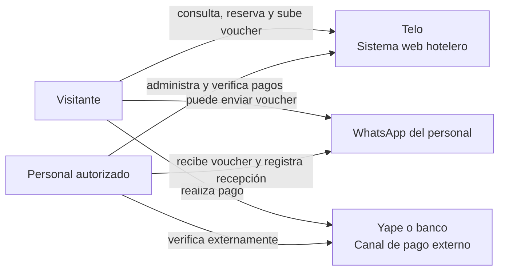

# C1 · Contexto del sistema

Este diagrama muestra Telo como sistema completo y las personas o canales con los que interactúa. Describe el destino de la arquitectura V1; no representa integraciones automáticas que no están en alcance.

Telo no integra APIs de Yape, bancos o WhatsApp. Estos canales se tratan como procesos externos y la validación del pago la realiza el personal.

La aplicación tampoco utiliza Supabase Auth, REST API, Storage ni Edge Functions. Supabase aloja PostgreSQL y se accede con JDBC/JPA estándar.
