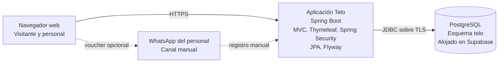

# C2 · Contenedores

Telo V1 se compone de una aplicación web Spring Boot y una base PostgreSQL. Ambos componentes se comunican mediante JDBC; no existe una aplicación móvil, API pública ni backend adicional.

| Contenedor | Responsabilidad |
| --- | --- |
| Navegador | Web pública ES/EN, reserva, envío de voucher y administración autenticada. |
| Aplicación Telo | Reglas de disponibilidad, bloqueo de cupo, validación, pagos manuales, historial, traducciones y autorización. |
| PostgreSQL | Datos del dominio, restricciones, auditoría, índices y migraciones Flyway dentro de `telo`. |
| WhatsApp | Canal externo de envío del voucher; no tiene integración de software. |

La aplicación es un monolito modular. `reservas` es el módulo Core y contiene disponibilidad, solicitudes, vouchers y pagos manuales. `catálogo` y `configuración del hotel` son módulos de soporte: el primero es dueño del inventario vendible y las tarifas; el segundo, compartido, es dueño de los datos institucionales, idiomas, zona horaria y medios de pago. `identidad y acceso` es una capacidad transversal de usuarios, autorización y auditoría. La web pública y la administración son interfaces, no módulos dueños de datos. Futuras capacidades como recepción de estadías, contabilidad, planilla, inventario y housekeeping se incorporarán como módulos separados, con sus propias tablas y reglas, sin convertir prematuramente V1 en microservicios.

La aplicación mantiene `ddl-auto=validate`. Flyway aplica las migraciones y PostgreSQL conserva la integridad de datos. La lógica de disponibilidad y concurrencia se documenta en [Diseño del dominio y datos](dominio-v1.md).
